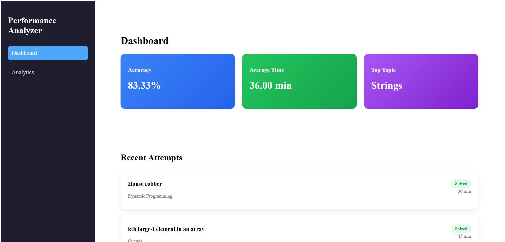
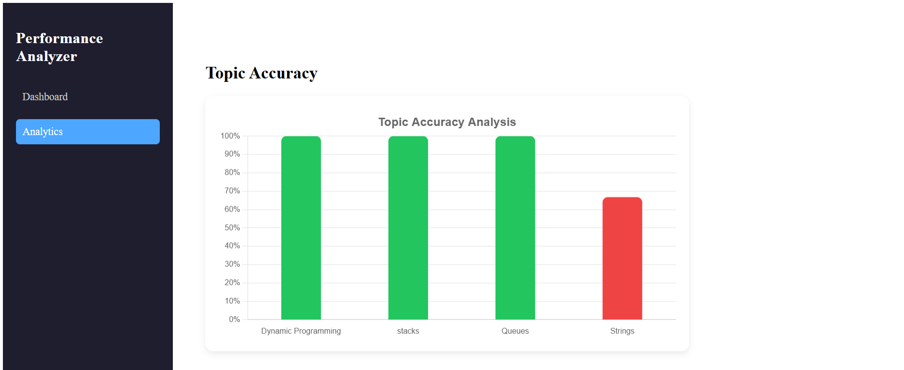
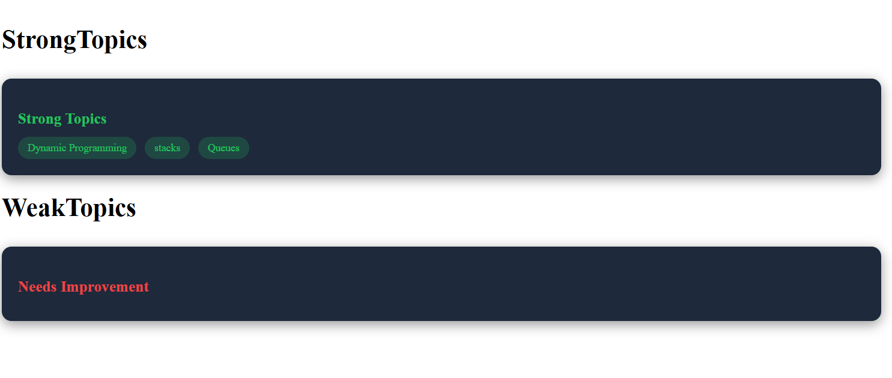
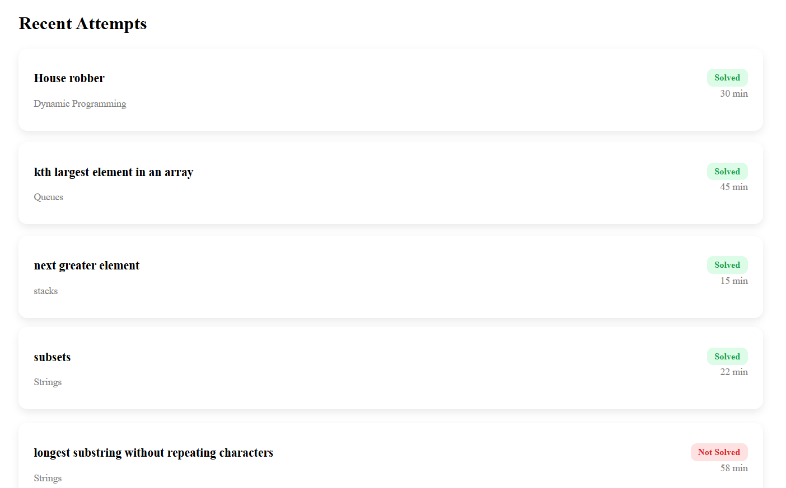

# Interview Analyzer 🚀

A full-stack web application that helps users analyze their coding performance, identify strong and weak topics, and track their progress visually.

---

## 🔥 Features

* 📊 Topic-wise accuracy analysis (Bar Chart)
* 📈 Strong & Weak topic identification
* 🕒 Recent attempts tracking
* 📌 Clean dashboard UI
* 🔐 Backend with API handling

---

## 🛠️ Tech Stack

### Frontend

* React.js
* Axios
* Chart.js
* CSS

### Backend

* Spring Boot
* Spring Data Jpa
* MySQL

---

## 📁 Project Structure

```
Interview_analyzer/
 ├── frontend/              # Frontend (React)
 ├── src/                   # Backend (Spring Boot)
 ├── pom.xml
```

---

## ⚙️ How to Run Locally

### 1️⃣ Backend

```
cd Interview_analyzer
mvn spring-boot:run
```


### 2️⃣ Frontend

```
cd Interview_analyzer
cd frontend
npm install
npm start
```


## 🚀 Live Application

- 🌐 Frontend (Vercel): https://interview-analyzer-two.vercel.app/
- 🔗 Backend API (Render): https://interview-analyzer-8c77.onrender.com


## 🚀 Live Demo

👉 [Open App](https://interview-analyzer-two.vercel.app/)


## 📸 Screenshots

### Dashboard


---

### Analytics


---

### Strong & Weak Topics


### RecentAttempts



---

## 🚀 Future Improvements

* User authentication UI
* Performance analytics graphs
* Deployment with cloud services

---

## 👨‍💻 Author

Siva Sankar
